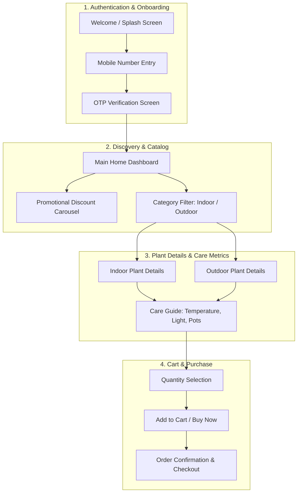

# 🌱 Imagine Plants – Mobile Plant Marketplace & Care Companion

[](https://github.com/AlwaysPratik/Imagine_Plants/actions/workflows/build-apk.yml)
[](https://github.com/AlwaysPratik/Imagine_Plants/releases)
[](https://flutter.dev)
[](https://flutter.dev/multi-platform)
[](https://material.io)
[]()

An aesthetic, cross-platform mobile e-commerce and plant care application built with **Flutter**. Designed for plant enthusiasts, urban gardeners, and local nurseries, **Imagine Plants** combines seamless online shopping with detailed botanical care guides (watering, sunlight, temperature, and pot dimensions) in a clean, nature-inspired user interface.

---

## 📑 Table of Contents

- [Overview](#-overview)
- [Key Features](#-key-features)
- [Application Flow & Architecture](#-application-flow--architecture)
- [Screen Highlights](#-screen-highlights)
- [Technology Stack](#-technology-stack)
- [Repository Structure](#-repository-structure)
- [Getting Started & Local Setup](#-getting-started--local-setup)
  - [Prerequisites](#prerequisites)
  - [Installation & Running](#installation--running)
  - [Build Release APK Locally](#build-release-apk-locally)
- [Download Release Packages](#-download-release-packages)
- [CI/CD Automation](#-cicd-automation)
- [Author & Credits](#-author--credits)

---

## 🌿 Overview

Urban gardening and indoor greenery enhance wellness, productivity, and home aesthetics. However, finding the right plants suited to specific indoor lighting and outdoor climate conditions can be overwhelming.

**Imagine Plants** bridges this gap by offering:
1. **Interactive Marketplace**: Browse and purchase indoor air-purifying foliage, flowering outdoor species, organic seeds, and designer pots.
2. **Plant Care Companion**: Every plant features dedicated care metrics — optimal temperature ranges, watering schedules, and pot sizing recommendations to keep plants thriving.
3. **Frictionless Onboarding**: Secure OTP-based authentication paired with an intuitive, modern design that delivers a smooth shopping journey.

---

## ✨ Key Features

### 🪴 Curated Botanical Catalog
- **Indoor & Outdoor Collections**: Filter by indoor low-light plants or outdoor sun-loving varieties.
- **Detailed Care Specs**: View vital environmental indicators including humidity, sunlight requirements, and temperature ranges.
- **Granular Plant Details**: Explore rich descriptions, high-resolution imagery, and botanical specifications before purchasing.

### 🛍️ Dynamic Shopping Experience
- **Promotional Carousels**: Integrated discount banners (e.g., 30% OFF Seasonal Sales) powered by smooth horizontal scrolling.
- **Instant Cart Actions**: Add to cart, adjust quantities with 1-tap increment/decrement counters, and proceed to checkout.
- **Categorized Discovery**: Dedicated sections for Plants, Seeds, Planters/Pots, and Gardening Tools.

### 🔐 Modern Onboarding & OTP Verification
- **Visual Onboarding**: High-fidelity welcome screens and onboarding flows.
- **OTP Verification Flow**: Instant numeric OTP input powered by `flutter_otp_text_field`.

### 🎨 Premium Visual Aesthetics
- **Nature-Inspired Palette**: Earthy greens (`#1B5E20`, `#A4E07A`), soft neutrals, and crisp typography.
- **Smooth Animations**: Interactive indicators using `smooth_page_indicator` for banner navigation and page transitions.

---

## 🔄 Application Flow & Architecture



---

## 📱 Screen Highlights

| Screen | File | Key Capabilities |
|---|---|---|
| **Welcome / Login** | `lib/login.dart` & `lib/login1.dart` | Phone number entry, onboarding graphics, and navigation router |
| **OTP Verification** | `lib/verification.dart` | 4-digit code verification field (`flutter_otp_text_field`) and resend flow |
| **Home Dashboard** | `lib/homepage.dart` | Promo banners, search bar, category tabs, and plant grid cards |
| **Indoor Plant Details** | `lib/plantdetailsin.dart` | Care metrics, watering reminders, temperature range, and buy buttons |
| **Outdoor Plant Details**| `lib/plantdetailsout.dart`| Outdoor environmental requirements, sunlight guides, and pot sizing |

---

## 🛠️ Technology Stack

| Domain | Technology | Description |
|---|---|---|
| **Framework** | Flutter 3.x | Google's cross-platform UI toolkit |
| **Language** | Dart 3.x | Object-oriented client-optimized language |
| **UI Components** | Material 3 & Custom Widgets | Custom cards, glassmorphic shadows, and rounded containers |
| **OTP Input** | `flutter_otp_text_field: ^1.1.0+2` | Streamlined pin entry for verification |
| **Indicators** | `smooth_page_indicator: ^1.1.0` | Customizable animated carousel page indicators |
| **Platforms** | Android, iOS, Web, macOS, Windows | Cross-platform code base |
| **CI / CD** | GitHub Actions | Automated Android APK builds and versioned release assets |

---

## 📂 Repository Structure

```
Imagine_Plants/
├── .github/
│   └── workflows/
│       ├── build-apk.yml       # Automated CI workflow building release APK on push
│       └── release.yml         # Automated CD workflow publishing releases on git tags
├── android/                    # Native Android project configuration & Gradle wrapper
├── assets/                     # High-resolution plant imagery and UI iconography
│   ├── home1.png ... home6.png # Dashboard banners and plant thumbnails
│   ├── login1.png, login2.png  # Onboarding illustrations
│   └── pot.png, temp.png       # Care metric iconography
├── ios/                        # Native iOS configuration files
├── lib/                        # Core Flutter application source code
│   ├── main.dart               # App entry point & theme initialization
│   ├── login.dart              # Onboarding welcome screen
│   ├── login1.dart             # Phone number submission screen
│   ├── verification.dart       # OTP verification interface
│   ├── homepage.dart           # Plant catalog & category dashboard
│   ├── plantdetailsin.dart     # Indoor plant care and purchase view
│   └── plantdetailsout.dart    # Outdoor plant care and purchase view
├── pubspec.yaml                # Package dependencies, fonts & asset definitions
└── README.md                   # Comprehensive project documentation
```

---

## ⚡ Getting Started & Local Setup

### Prerequisites
- **Flutter SDK**: Version 3.19.0 or higher ([Install Flutter](https://docs.flutter.dev/get-started/install)).
- **Dart SDK**: Bundled with Flutter.
- **Java Development Kit**: JDK 17 (recommended for modern Android Gradle builds).
- **IDE**: Android Studio or Visual Studio Code with the Flutter extension.

### Installation & Running
```bash
# 1. Clone the repository
git clone https://github.com/AlwaysPratik/Imagine_Plants.git

# 2. Navigate to project root
cd Imagine_Plants

# 3. Fetch package dependencies
flutter pub get

# 4. Run on a connected device or emulator
flutter run
```

### Build Release APK Locally
To build a standalone, release-optimized Android APK:
```bash
flutter build apk --release
```

The output file will be generated at:
```
build/app/outputs/flutter-apk/app-release.apk
```

---

## 📦 Download Release Packages

Pre-compiled, ready-to-install Android packages are published under the **Releases** tab:

- 📥 **[Download Latest Release APK](https://github.com/AlwaysPratik/Imagine_Plants/releases)**
- Direct Download: Get `Imagine-Plants-v1.0.0.apk` from the Assets list of each release.

### How to Install:
1. Download `Imagine-Plants-v1.0.0.apk` to your Android device.
2. Open the file and enable **"Install from unknown sources"** if prompted.
3. Tap **Install** and explore the application.

---

## 🤖 CI/CD Automation

This repository includes continuous integration and automated deployment:

1. **Continuous Integration (`build-apk.yml`)**:
   - Triggers on every push and pull request to `master` and `main`.
   - Sets up Temurin JDK 17 and the stable Flutter channel.
   - Runs `flutter build apk --release` and uploads the generated APK as a downloadable CI artifact.
2. **Release Deployment (`release.yml`)**:
   - Triggers automatically whenever a version tag matching `v*` (e.g. `v1.0.0`) is pushed.
   - Compiles `app-release.apk`, attaches it to a new GitHub Release, and generates release notes.

---

## 👤 Author & Credits

- **Developer**: [Pratik Raut](https://github.com/AlwaysPratik)
- **LinkedIn**: [linkedin.com/in/pratikraut](https://linkedin.com/in/pratikraut)
- **Email**: [pratikraut8000@gmail.com](mailto:pratikraut8000@gmail.com)

---

## 📄 License

This project is open-source and available for educational and showcase purposes.
